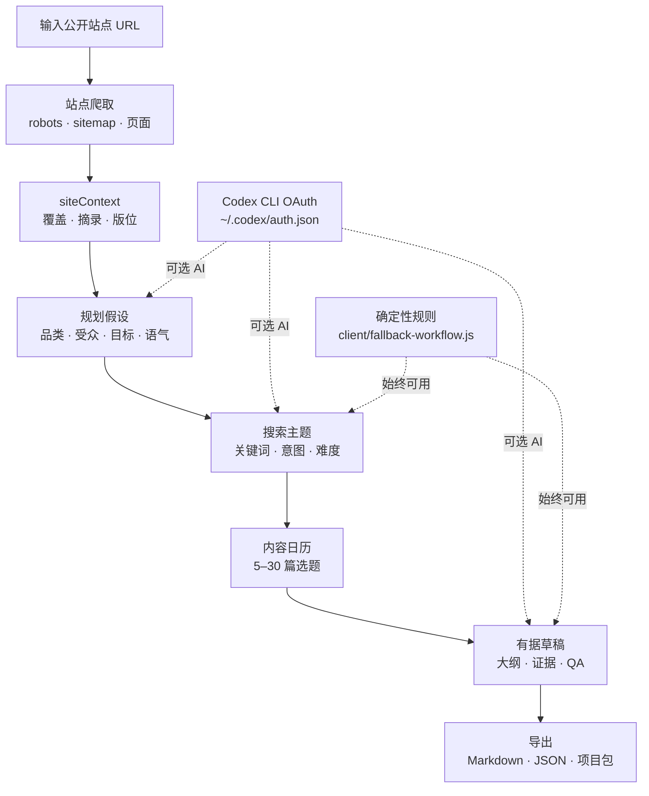
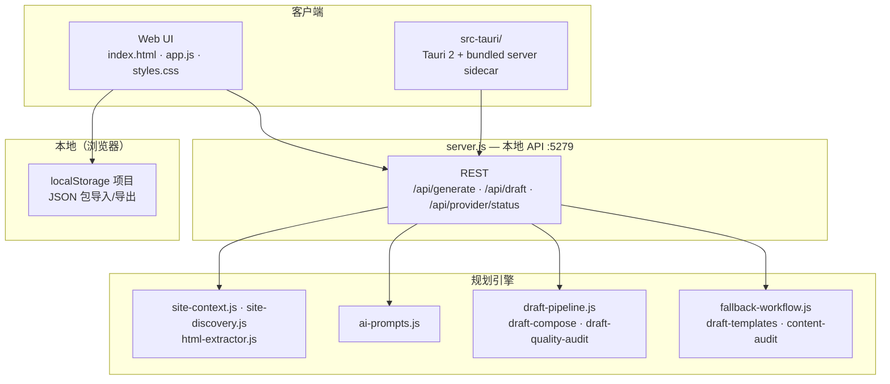

<p align="center">
  
</p>

# Rankwell

**本地优先、证据驱动的 SEO 内容规划**

爬取公开站点 · 搜索主题 · 编辑日历 · 有据草稿大纲

<br>


<br>

[⚡ 快速开始](#快速开始) · [🖥 桌面版](#桌面版-macos) · [📖 English](README.md)

<br>

[English](README.md) · **简体中文**

<br>

---

Rankwell 回答的问题是：**「这个站点接下来该发什么内容？」** —— 先爬取真实页面，再在本地基于**可核验的站点证据**规划关键词、内容日历与草稿大纲，而不是依赖 SaaS 黑箱或一次性聊天提示词。

| | 能力 | 你将获得 |
|:--:|------|----------|
| 🕸 | **[站点爬取](#站点爬取与覆盖报告)** | `robots.txt` → sitemap → 同域爬取；覆盖报告、页面类型、失败记录与时间线 |
| 🔎 | **[搜索主题](#搜索主题)** | 带意图、契合度、难度与问题变体的关键词候选 |
| 📅 | **[内容日历](#内容日历)** | 可配置长度的编辑计划（5–30 篇），映射格式与版位 |
| ✍️ | **[有据草稿](#有据草稿)** | 含 `evidenceRefs`、视觉方案与自动化 QA 的页面感知大纲 |

**Web UI** 位于仓库根目录（`index.html`、`app.js`）。**本地 API** 为 `server.js`，爬取、提示词与草稿引擎在 [`lib/`](lib/)。**macOS 桌面版** 为 [`src-tauri/`](src-tauri/) —— Tauri 2 壳，捆绑 Node sidecar 与静态 UI。

## 架构

### 产品流程

从单个 URL 到可导出产物的四个阶段如何串联：



### 项目结构（技术视角）



草稿生成是**证据驱动**的：章节通过 `evidenceRefs` 引用爬取到的 URL 与摘录；配置 LLM 时在其上规划与撰写，**未配置时**确定性回退路径仍可产出主题、日历项与大纲。

## 与 SaaS SEO 工具、裸 LLM 对话的差异

| | **SaaS SEO 规划器** | **ChatGPT / 一次性 LLM** | **Rankwell** |
|---|---------------------|--------------------------|--------------|
| **核心问题** | 我们的工具推荐什么词？ | 帮我为这个 URL 写 SEO 方案 | *这个*站点基于*真实页面*该发什么？ |
| **工作单元** | 云端账号 + URL | 单条提示词 / 对话 | 爬取快照 → 主题 → 日历 → 草稿流水线 |
| **输出** | 关键词列表、通用简报 | 未核验的文案，常编造 URL | 覆盖报告、主题日历、含 `evidenceRefs` 的大纲 + QA |
| **站点认知** | 厂商服务器不透明爬取 | 模型臆测 | 本机确定性同域爬取（60 页 · 深度 3） |
| **AI 角色** | 核心（厂商模型） | 核心（你的会话） | 可选 Codex CLI；**规则回退始终可用** |
| **数据驻留** | 厂商云端 | 提示词发往提供商 | 爬取与项目留本地；无云端规划后端 |
| **最适合** | 已采购 SEO 套件的团队 | 快速头脑风暴 | 需要**可审阅、可导出**发布前规划的操作者 |

**搭配使用：** 排名追踪或 CMS 负责**线上表现**；Rankwell 负责**结构化、有据可依的编辑计划** —— 不能替代分析、排名追踪或完整 CMS 工作流。

## 功能详解

### 站点爬取与覆盖报告

生成前的受控发现：

- `robots.txt` → sitemap 索引 → 同域链接爬取（[`lib/site-discovery.js`](lib/site-discovery.js)、[`lib/site-context.js`](lib/site-context.js)）
- 覆盖报告：策略、页面数、类型、失败记录、参考图、爬取时间线
- 安全护栏：跳过登录、购物车、搜索、结账及常见静态资源
- 默认限制：**60 页** · **深度 3** · **12 个 sitemap 文件**
- 默认禁止本地/内网目标（设 `ALLOW_PRIVATE_TARGETS=1` 可覆盖）

### 搜索主题

与爬取结果绑定的关键词规划：

- 候选词附带搜索意图、契合度、难度与问题变体
- 规划输入：产品品类、受众、转化目标、品牌语气
- AI 自动推断，可在高级选项手动覆盖
- Codex 不可用时由确定性引擎生成主题（[`client/fallback-workflow.js`](client/fallback-workflow.js)）

### 内容日历

起草前可微调的编辑排期：

- 滑块控制 **5–30** 篇选题（[`lib/plan-length.js`](lib/plan-length.js)）
- 每项含标题、关键词、意图、格式（`guide`、`comparison`、`playbook` 等）、版位（`blog`、产品区等）
- 日历审计：重复标题、泛化品类检测（[`lib/content-audit.js`](lib/content-audit.js)）

### 有据草稿

按日历项运行的多阶段草稿流水线（[`lib/draft-pipeline.js`](lib/draft-pipeline.js)）：

| 阶段 | 需要 LLM？ | 输出 |
|------|-----------|------|
| **Plan** | 可选 | `draftIntent` — 角度、章节、接地目标 |
| **Compose** | 否 | 由 `siteContext` + 日历项组装的上下文 |
| **Write** | 可选 | 大纲块、版位 URL、视觉方案 |
| **Audit** | 否 | QA：接地性、URL、Schema、模板契合、文案质量 |

- `evidenceRefs` — 爬取页面的来源 URL 与摘录
- `visualPlan` — 资产类型、生成规格、参考图、alt 文案
- `qaChecks` — 发布前自动化审阅项
- 语气预设：`sharp` · `editorial` · `technical` · `friendly` · `founder`

**未配置任何 LLM** 时，仍可返回主题、日历、回退大纲与 QA 结果。

### 本地工作区与导出

- 项目保存在浏览器 `localStorage`（[`client/local-projects.js`](client/local-projects.js)）
- JSON 项目包可跨设备导入/导出
- 导出 Markdown、原始 JSON 或完整项目包（[`client/markdown-export.js`](client/markdown-export.js)、[`client/download.js`](client/download.js)）
- 发布检查清单分类（[`client/checklist-taxonomy.js`](client/checklist-taxonomy.js)）

## Rankwell 不是什么

- **不是排名追踪或分析面板** — 无 SERP 位置、流量或 GSC 集成
- **不是 CMS 或发布器** — 导出计划与草稿，不直接发到 WordPress、Webflow 等
- **不是通用爬虫** — 仅为规划上下文做的有界同域爬取
- **不能替代人工编辑** — QA 辅助审阅，不保证可直接发布的成稿

## 快速开始

需要 **Node.js 18+**（推荐 20+）及访问目标站点的网络。

```bash
git clone https://github.com/ingeniousfrog/Rankwell.git
cd Rankwell
npm install --cache ./.npm-cache
npm run start
```

打开 [http://127.0.0.1:5279](http://127.0.0.1:5279)（或终端打印的地址）。

1. **输入** 公开网站 URL
2. **调整** 计划长度、写作风格或高级规划字段
3. **分析** — 爬取完成后生成主题、日历与起始草稿
4. **审阅** 站点覆盖、主题、日历、草稿大纲与检查清单
5. **导出** Markdown、JSON 或项目包

## 配置 Codex（可选）

Rankwell 复用你**已有的 Codex CLI 登录** —— 无需在 Web UI 粘贴 API Key。

### 1. 使用 Codex CLI 登录

```bash
# 如未安装：https://github.com/openai/codex
codex login
```

将在 `~/.codex/auth.json` 创建或更新 ChatGPT OAuth（`auth_mode = chatgpt`）。可用 `CODEX_HOME` 覆盖目录。

### 2. 在 Rankwell 中验证

1. 启动应用（`npm run start` 或桌面版）
2. 查看 `/api/provider/status` 或界面中的 Codex 状态面板
3. 可选设置 `AI_MODEL`（如 `gpt-5.5`），或使用 `~/.codex/config.toml` 中的 `model`

### 3. 生成

点击 **Analyze with AI**。Codex 缺失或失败时仍有确定性回退输出；模型负责增强规划与文案 —— **证据引用与 QA 检查仍是权威依据**。

### Codex 排障

| 现象 | 处理建议 |
|------|----------|
| 找不到 `auth.json` | 在与 Rankwell 服务同一台机器上执行 `codex login` |
| 提供方状态未认证 | 确认 `~/.codex/auth.json` 中 `auth_mode` 为 `chatgpt` |
| 生成超时 | 重试；检查网络/VPN；大站点爬取+草稿耗时更长 |
| AI 失败但主题/日历正常 | 预期回退行为 — 修复 Codex 后重跑以获得更丰富的草稿 |
| 端口冲突 | 见[限制说明](#限制说明) — 同一端口只能跑一个服务实例 |

## API 参考

基础地址：[http://127.0.0.1:5279](http://127.0.0.1:5279)

| 方法 | 端点 | 说明 |
|------|------|------|
| `GET` | `/api/provider/status` | Codex 认证状态与当前模型 |
| `POST` | `/api/generate` | 爬取站点并生成完整规划工作区 |
| `POST` | `/api/draft` | 为单个日历条目生成草稿 |

### `POST /api/generate`

```json
{
  "url": "https://example.com",
  "domain": "example.com",
  "category": "",
  "audience": "",
  "goal": "",
  "voice": "",
  "planLength": 14
}
```

- `planLength` — 限制在 **5–30**
- `voice` — `sharp` · `editorial` · `technical` · `friendly` · `founder` · 或留空由 AI 推断

### `POST /api/draft`

```json
{
  "input": { "url": "https://example.com", "domain": "example.com", "planLength": 14 },
  "calendarItem": {
    "day": 1,
    "title": "选题标题",
    "keyword": "目标关键词",
    "intent": "Problem",
    "format": "guide",
    "placement": "blog"
  },
  "existingTitles": []
}
```

### 草稿对象字段

| 字段 | 说明 |
|------|------|
| `placement` | 建议的内容版位或页面类型 |
| `placementUrl` | 现有或拟议 URL |
| `visualPlan` | 资产类型、生成规格、参考图、alt 文案 |
| `evidenceRefs` | 用于接地的来源 URL 与摘录 |
| `qaChecks` | 发布前自动化审阅项 |

## 本地工作区

| 位置 | 用途 |
|------|------|
| 浏览器 `localStorage` | 已保存的 Rankwell 项目（UI） |
| 导出的 `.json` 包 | 可移植项目导入/导出 |
| `~/.codex/` | Codex CLI 认证与配置（可选 AI） |

爬取结果保存在会话/API 响应中 —— Rankwell 不会将站点数据上传至云端规划服务。

## 限制说明

- **公开 HTML 站点** — JS 重度 SPA 可能爬取上下文稀疏
- **仅同域爬取** — 不支持跨域或需登录页面
- **Codex：仅本地 CLI 会话** — 无浏览器内 OAuth 或内置 OpenAI API Key 界面
- **目前仅 macOS 桌面版** — Tauri 构建 Apple Silicon DMG（`src-tauri/`）
- **单端口** — 默认 `5279`；勿与已安装的桌面版同时在本机跑 `npm run start`
- **英文优先的提示词** — UI 为英文；生成内容语言随站点与输入而定

## 桌面版 (macOS)

Rankwell 提供 **macOS 桌面应用**（[`src-tauri/`](src-tauri/)）—— Tauri 2 壳捆绑 Node API sidecar 与静态 UI，终端用户无需单独 `npm run start`。

**版本号** 来自 [`src-tauri/tauri.conf.json`](src-tauri/tauri.conf.json)（当前 `0.1.0`）。

### 从源码构建

**依赖：** macOS、[Rust](https://rustup.rs/)、Xcode Command Line Tools、仓库开发依赖。

```bash
npm install --cache ./.npm-cache

# 开发：Tauri 窗口 + 本地服务
npm run tauri:dev

# 发布：.app + .dmg（未签名；首次打开可能受 Gatekeeper 拦截）
npm run tauri:build
```

**产物路径：**

```text
src-tauri/target/release/bundle/dmg/Rankwell_0.1.0_aarch64.dmg
src-tauri/target/release/bundle/macos/Rankwell.app
```

**安装（macOS）：** 打开 DMG → 将 **Rankwell** 拖入「应用程序」。

若 macOS 拦截未签名构建，右键应用 → **打开**，或执行：

```bash
xattr -cr /Applications/Rankwell.app
```

**勿在使用已安装应用时同时运行 `npm run start`** —— 两者均占用端口 `5279`。

## 开发与测试

```bash
npm test      # 71 项单元 / 集成测试
npm run check # 服务端与客户端模块语法检查
```

环境变量：

| 变量 | 默认值 | 说明 |
|------|--------|------|
| `PORT` | `5279` | 本地 HTTP 服务端口 |
| `CODEX_HOME` | `~/.codex` | Codex 配置与认证目录 |
| `AI_MODEL` | Codex 配置或 `gpt-5.5` | 覆盖生成所用模型 |
| `ALLOW_PRIVATE_TARGETS` | 未设置 | 设为 `1` 以允许 localhost / 内网爬取目标 |

### 目录结构

```
rankwell/
├── index.html              # Web UI 入口
├── app.js                  # 客户端逻辑
├── server.js               # 本地 API 服务
├── client/                 # UI 模块（导出、项目、工作流）
├── lib/                    # 爬取、AI 提示词、草稿流水线
├── test/                   # Node 测试套件
├── scripts/bundle-server.sh
├── src-tauri/              # Tauri 桌面壳 + bundled sidecar
├── brand-logo.svg
├── package.json
├── LICENSE
├── README.md
└── README-CN.md
```

## 许可证

Apache License 2.0 — 详见 [LICENSE](LICENSE)。
