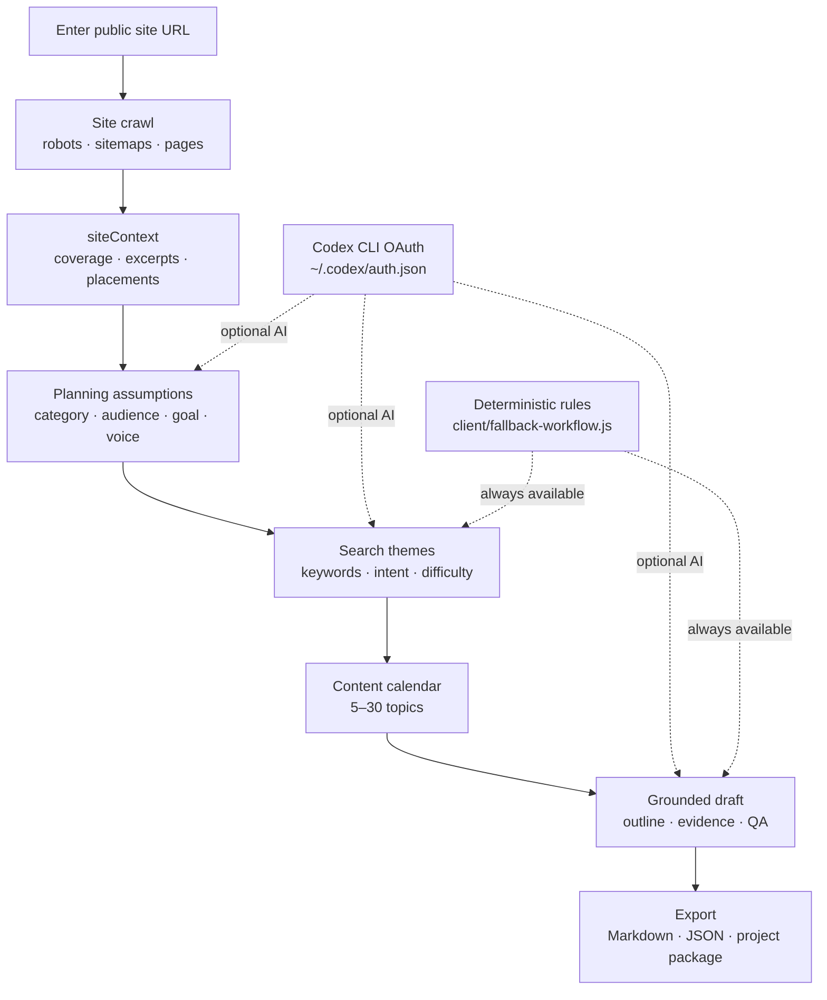
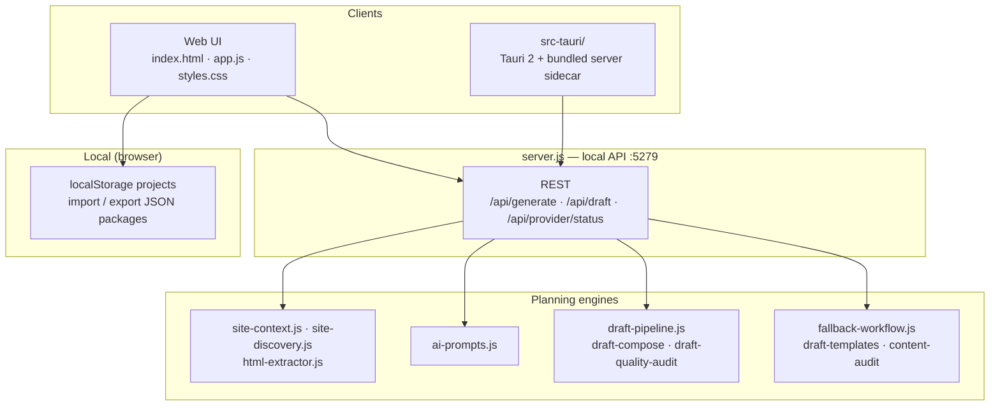

<p align="center">
  
</p>

# Rankwell

**Local-first, evidence-grounded SEO content planning**

Crawl a public site · search themes · editorial calendar · grounded draft outlines

<br>


<br>

[⚡ Quick start](#quick-start) · [🖥 Desktop](#desktop-macos) · [📖 简体中文](README-CN.md)

<br>

**English** · [简体中文](README-CN.md)

<br>

---

Rankwell answers **“what should this site publish next?”** by crawling real pages first, then planning keywords, a content calendar, and draft outlines from **evidence on your machine** — not from a SaaS black box or a one-shot chat prompt.

| | Capability | What you get |
|:--:|------------|--------------|
| 🕸 | **[Site crawl](#site-crawl--coverage)** | `robots.txt` → sitemaps → same-origin crawl; coverage report, page types, failures, timeline |
| 🔎 | **[Search themes](#search-themes)** | Keyword candidates with intent, fit, difficulty, and question variants |
| 📅 | **[Content calendar](#content-calendar)** | Configurable editorial plan (5–30 topics) mapped to formats and placements |
| ✍️ | **[Grounded drafts](#grounded-drafts)** | Page-aware outlines with `evidenceRefs`, visual plans, and automated QA checks |

The **web UI** lives at the repo root (`index.html`, `app.js`). The **local API** is `server.js` with crawl, prompt, and draft engines under [`lib/`](lib/). The **macOS desktop app** is [`src-tauri/`](src-tauri/) — a Tauri 2 shell that bundles the Node sidecar and static UI.

## Architecture

### Product flow

How the four stages connect from a single URL to exportable output:



### Project layout (technical)



Draft generation is **evidence-grounded**: sections cite crawled URLs and excerpts via `evidenceRefs`; the LLM (when configured) plans and writes on top of a fixed site context — the deterministic fallback path still produces themes, calendar items, and outlines without any model.

## How Rankwell differs from SaaS SEO tools and raw LLM chat

| | **SaaS SEO planner** | **ChatGPT / one-shot LLM** | **Rankwell** |
|---|----------------------|----------------------------|--------------|
| **Primary question** | What keywords does our tool suggest? | Write me an SEO plan for this URL | What should *this* site publish next, grounded in *its* pages? |
| **Unit of work** | Account + URL in a cloud dashboard | Single prompt / thread | Crawl snapshot → themes → calendar → draft pipeline |
| **Output** | Keyword lists, generic briefs | Unverified prose, often invented URLs | Coverage report, themed calendar, outlines with `evidenceRefs` + QA |
| **Site knowledge** | Opaque crawl on vendor servers | Whatever the model hallucinates | Deterministic same-origin crawl (60 pages · depth 3) on your machine |
| **AI role** | Central (vendor model) | Central (your chat session) | Optional via Codex CLI; **rules fallback always works** |
| **Data residency** | Vendor cloud | Prompt sent to provider | Crawl + projects stay local; no planner backend |
| **Best for** | Teams already on a SEO suite | Quick brainstorming | Operators who want a **reviewable, exportable** plan before publishing |

**Use together:** a rank tracker or CMS for **live performance**; Rankwell when you need a **structured, evidence-backed editorial plan** you can audit and export — not a replacement for analytics, rank tracking, or a full CMS workflow.

## Features

### Site crawl & coverage

Controlled discovery before any generation step:

- `robots.txt` → sitemap indexes → same-origin link crawl ([`lib/site-discovery.js`](lib/site-discovery.js), [`lib/site-context.js`](lib/site-context.js))
- Coverage report: strategy, page counts, types, failures, reference images, crawl timeline
- Guardrails: skips login, cart, search, checkout, and common static assets
- Default limits: **60 pages** · **depth 3** · **12 sitemap files**
- Local and private-network targets blocked by default (`ALLOW_PRIVATE_TARGETS=1` to override)

### Search themes

Keyword planning tied to the crawled site:

- Candidates with search intent, fit score, difficulty, and question variants
- Planning inputs: product category, audience, conversion goal, brand voice
- AI-inferred defaults with manual override in Advanced options
- Deterministic theme generation when Codex is unavailable ([`client/fallback-workflow.js`](client/fallback-workflow.js))

### Content calendar

Editorial schedule you can tune before drafting:

- Slider-controlled length from **5 to 30** topics ([`lib/plan-length.js`](lib/plan-length.js))
- Each item: title, keyword, intent, format (`guide`, `comparison`, `playbook`, …), placement (`blog`, product area, …)
- Calendar audit for duplicate titles and generic categories ([`lib/content-audit.js`](lib/content-audit.js))

### Grounded drafts

Multi-stage draft pipeline per calendar item ([`lib/draft-pipeline.js`](lib/draft-pipeline.js)):

| Stage | LLM required? | Output |
|-------|---------------|--------|
| **Plan** | Optional | `draftIntent` — angle, sections, grounding targets |
| **Compose** | No | Context from `siteContext` + calendar item |
| **Write** | Optional | Outline blocks, placement URL, visual plan |
| **Audit** | No | QA checks: grounding, URLs, schema, template fit, copy quality |

- `evidenceRefs` — source URLs and excerpts from crawled pages
- `visualPlan` — asset type, generation spec, references, alt text
- `qaChecks` — automated review items before publish
- Voice presets: `sharp` · `editorial` · `technical` · `friendly` · `founder`

**Without any LLM configured**, Rankwell still returns themes, calendar, fallback outlines, and QA results from the rules engine.

### Local workspace & export

- Projects persisted in browser `localStorage` ([`client/local-projects.js`](client/local-projects.js))
- Import/export portable JSON packages between machines
- Export Markdown, raw JSON, or a full project package ([`client/markdown-export.js`](client/markdown-export.js), [`client/download.js`](client/download.js))
- Publish checklist taxonomy ([`client/checklist-taxonomy.js`](client/checklist-taxonomy.js))

## What Rankwell is not

- **Not a rank tracker or analytics dashboard** — no SERP positions, traffic, or GSC integration
- **Not a CMS or publisher** — exports plans and drafts; does not post to WordPress, Webflow, etc.
- **Not a generic web scraper** — same-origin, bounded crawl for planning context only
- **Not a replacement for human editors** — QA checks assist review; they do not guarantee publish-ready copy

## Quick start

Requires **Node.js 18+** (20+ recommended) and network access to the target site.

```bash
git clone https://github.com/ingeniousfrog/Rankwell.git
cd Rankwell
npm install --cache ./.npm-cache
npm run start
```

Open [http://127.0.0.1:5279](http://127.0.0.1:5279) (or the URL printed in the terminal).

1. **Enter** a public website URL
2. **Adjust** plan length, writing style, or advanced planning fields
3. **Analyze** — crawl runs, then themes, calendar, and starter draft are generated
4. **Review** site coverage, themes, calendar, draft outline, and checklist
5. **Export** Markdown, JSON, or a project package

## Configure Codex (optional)

Rankwell reuses your **existing Codex CLI login** — no API key pasted into the web UI.

### 1. Log in with Codex CLI

```bash
# Install Codex CLI if needed: https://github.com/openai/codex
codex login
```

This creates or updates `~/.codex/auth.json` (ChatGPT OAuth, `auth_mode = chatgpt`). Override the directory with `CODEX_HOME`.

### 2. Verify in Rankwell

1. Start the app (`npm run start` or the desktop build)
2. Check `/api/provider/status` or the Codex panel in the UI
3. Optionally set `AI_MODEL` (e.g. `gpt-5.5`) or rely on `model` from `~/.codex/config.toml`

### 3. Generate

Click **Analyze with AI**. Deterministic fallback output still appears if Codex is missing or fails; model output is enriched planning and prose — **evidence refs and QA checks remain the source of truth**.

### Codex troubleshooting

| Symptom | What to try |
|---------|-------------|
| `auth.json not found` | Run `codex login` on the same machine as the Rankwell server |
| Provider status shows unauthenticated | Confirm `auth_mode` is `chatgpt` in `~/.codex/auth.json` |
| Generation times out | Retry; check network/VPN; large sites may take longer during crawl + draft |
| AI fails but themes/calendar look fine | Expected fallback — fix Codex and rerun for richer drafts |
| Port conflict | See [Limitations](#limitations) — only one server instance per port |

## API reference

Base URL: [http://127.0.0.1:5279](http://127.0.0.1:5279)

| Method | Endpoint | Description |
|--------|----------|-------------|
| `GET` | `/api/provider/status` | Codex auth status and active model |
| `POST` | `/api/generate` | Crawl site and generate full planning workspace |
| `POST` | `/api/draft` | Generate a single draft for one calendar item |

### `POST /api/generate`

```json
{
  "url": "https://example.com",
  "domain": "example.com",
  "category": "",
  "audience": "",
  "goal": "",
  "voice": "",
  "planLength": 14
}
```

- `planLength` — clamped to **5–30**
- `voice` — `sharp` · `editorial` · `technical` · `friendly` · `founder` · or empty for AI inference

### `POST /api/draft`

```json
{
  "input": { "url": "https://example.com", "domain": "example.com", "planLength": 14 },
  "calendarItem": {
    "day": 1,
    "title": "Topic title",
    "keyword": "target keyword",
    "intent": "Problem",
    "format": "guide",
    "placement": "blog"
  },
  "existingTitles": []
}
```

### Draft object fields

| Field | Description |
|-------|-------------|
| `placement` | Recommended content area or page type |
| `placementUrl` | Existing or proposed URL |
| `visualPlan` | Asset type, generation spec, references, alt text |
| `evidenceRefs` | Source URLs and excerpts used for grounding |
| `qaChecks` | Automated review items before publish |

## Local workspace

| Location | Purpose |
|----------|---------|
| Browser `localStorage` | Saved Rankwell projects (UI) |
| Exported `.json` packages | Portable project import/export |
| `~/.codex/` | Codex CLI auth and config (optional AI) |

Crawl results are held in memory for the session/API response — Rankwell does not upload site data to a cloud planner backend.

## Limitations

- **Public HTML sites** — JavaScript-heavy SPAs may yield sparse crawl context
- **Same-origin crawl only** — no cross-domain or authenticated page access
- **Codex: local CLI session only** — no in-browser OAuth or built-in OpenAI API key UI
- **macOS desktop only** today — Tauri bundle targets Apple Silicon DMG (`src-tauri/`)
- **Single port** — default `5279`; do not run `npm run start` and the installed desktop app simultaneously on the same port
- **English-first prompts** — UI strings are English; generated content language follows site and inputs

## Desktop (macOS)

Rankwell ships a **macOS desktop app** ([`src-tauri/`](src-tauri/)) — a Tauri 2 shell that bundles the Node API sidecar and static UI. End users do not need a separate `npm run start` terminal.

**Version** is read from [`src-tauri/tauri.conf.json`](src-tauri/tauri.conf.json) (currently `0.1.0`).

### Build from source

**Requirements:** macOS, [Rust](https://rustup.rs/), Xcode Command Line Tools, repo dev dependencies.

```bash
npm install --cache ./.npm-cache

# Dev: Tauri window + local server
npm run tauri:dev

# Release: .app + .dmg (unsigned; Gatekeeper may prompt on first open)
npm run tauri:build
```

**Output:**

```text
src-tauri/target/release/bundle/dmg/Rankwell_0.1.0_aarch64.dmg
src-tauri/target/release/bundle/macos/Rankwell.app
```

**Install (macOS):** open the DMG → drag **Rankwell** to Applications.

If macOS blocks an unsigned build, right-click the app → **Open**, or:

```bash
xattr -cr /Applications/Rankwell.app
```

**Do not run `npm run start` while using the installed app** — both bind to port `5279`.

## Development

```bash
npm test      # 71 unit / integration tests
npm run check # syntax validation across server + client modules
```

Environment variables:

| Variable | Default | Meaning |
|----------|---------|---------|
| `PORT` | `5279` | Local HTTP server port |
| `CODEX_HOME` | `~/.codex` | Codex configuration and auth directory |
| `AI_MODEL` | from Codex config or `gpt-5.5` | Model override for generation |
| `ALLOW_PRIVATE_TARGETS` | unset | Set to `1` to allow localhost / private-network crawl targets |

### Project layout

```
rankwell/
├── index.html              # Web UI shell
├── app.js                  # Client application logic
├── server.js               # Local API server
├── client/                 # UI modules (export, projects, workflow)
├── lib/                    # Crawl, AI prompts, draft pipeline
├── test/                   # Node test runner suites
├── scripts/bundle-server.sh
├── src-tauri/              # Tauri desktop shell + bundled sidecar
├── brand-logo.svg
├── package.json
├── LICENSE
├── README.md
└── README-CN.md
```

## License

Apache License 2.0 — see [LICENSE](LICENSE).
