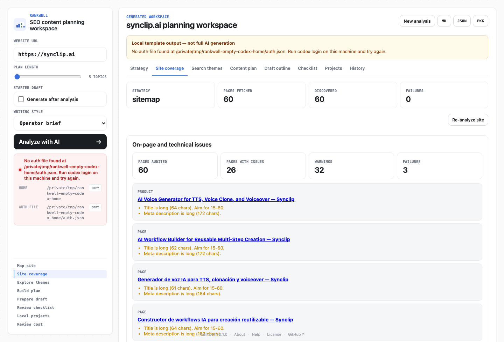

# 被朋友问起 SEO 之后

前阵子有个哥们跟我聊产品，聊着聊着冒出来一句：他们可能得开始做 SEO 了。

我脑子里没什么仪式感。第一反应就是：哦，关键词表、竞品页、文章排期、标题党，还有那句老问题——这篇到底谁来写。

一说 SEO，气氛就容易变正式。好像下一秒就得打开一个很贵的后台，或者让 GPT 先吐一份「30 天内容计划」。我都试过。但每次动手前，我总会先愣一下：这网站现在到底长什么样？

Rankwell 就是这么来的。

现在它能装到 macOS 上跑了。还谈不上成熟，但至少不再是我本地一个临时服务——可以打包成 DMG，拖进 Applications，像个小 app 那样打开。


*配图：差不多就是这种场景。哥们随口一提 SEO，我这边开始在纸上乱画。*

## 我对 SEO 的理解很土

我把 SEO 想得很土。

有人搜一个问题，搜索引擎得找到合适的页面，你的页面最好别让人猜半天——我目前就停在这个层面。

动手写东西之前，我通常会先翻一圈：

- 页面能不能正常打开。
- `robots.txt` 有没有写清楚哪些地方能看。
- sitemap 有没有把重要页面递出去。
- 标题、描述、H1/H2 读起来像不像人话。
- 现有页面有没有在回答真实问题。
- 有些旧页面是不是早该改了，一直搁着。

Google 的 SEO 入门文档讲的也是这些。排名、外链、竞品、转化、内容质量，后面当然一大堆。但我自己刚开始一个项目的时候，往往卡在「现场都没看清楚」这一步。


*配图：我画 SEO 的时候，脑子里是一张网站地图，不是一张神秘的关键词表。*

## Rankwell 先不写文章

做 SEO 工具，最诱人的是一上来就生成。

输个 URL，吐一堆选题，标题顺顺的，排期整整齐齐。问题是——它到底看过这个网站没有？我有时候分不出来。

所以 Rankwell 第一步有点笨：先抓网页。

流程大概是这样：

1. 输入一个公开网站 URL。
2. 先读 `robots.txt`，再找 sitemap。
3. 规则允许的话，在同域里做有上限的抓取。
4. 把标题、描述、H1/H2、正文摘要、图片引用整理成 `siteContext`。
5. 基于这份上下文，生成搜索主题、内容计划和草稿大纲。
6. 需要的话，导出 Markdown、JSON 或本地项目包。

桌面版是 Tauri 2 壳，里面带本地 Node sidecar 和静态前端。打开 app 后本地起服务，项目数据留在本机。Codex 登录配好了就让模型帮忙；没配好也能走 local-rules，结果笨一点，但还能用。


*配图：没有直接奔着成稿去，中间先绕去看了看现场。*

下面是我拿 `synclip.ai` 跑出来的界面：



*截图：这里我把 Codex 配置指到空目录，走的是 local-rules。没有模型参与，站点覆盖、页面数量和问题列表仍然能出来。*

## 拿 Synclip.ai 试一遍

我选 `https://synclip.ai` 做演示，因为它比较适合跑完整流程：能读 robots，能走 sitemap，也能抓到不少页面。

当时结果：

| 项目 | 结果 |
|---|---|
| URL | `https://synclip.ai` |
| provider | `local-rules` |
| robots | 可读取 |
| discovery strategy | sitemap |
| pages discovered | 60 |
| pages fetched | 60 |
| page types | home 1, pricing 3, product 1, about 3, page 52 |

数字不性感。但对我有用。

说明这次不是闭着眼睛写计划。Rankwell 从 sitemap 进去了，抓到 60 页，也能粗略分出 home、pricing、product、about 这些类型。

后面生成 Search themes 和 Content plan 的时候，local-rules 的标题还是朴素，有些地方一看就得改。我能接受——至少第一层材料摊在桌上了，不是一份看起来很顺、底下没东西的稿子。


*配图：先收页面证据，再聊选题。慢，但我心里比较有数。*

我自己用的时候比较克制：先跑 5 篇，看 Site coverage，再看 Search themes 和 Content plan。某个方向有意思，再生成 draft。

草稿出来我也不会直接发。先看 `evidenceRefs`，再看 `qaChecks`。句子太像模板，就删掉重写。

所以它在我这儿更像一张带批注的草稿纸。

## 百度这个例子

我还试了 `https://www.baidu.com`。

不是为了分析百度，也没打算写什么「百度 SEO 诊断」。我就是想看，遇到不该爬的站点，Rankwell 会不会停。

结果：

| 项目 | 结果 |
|---|---|
| attempted URLs | `https://www.baidu.com/`, `https://baidu.com/` |
| robots | 可读取 |
| pages fetched | 0 |
| failureKind | `robots-blocked` |
| 提示 | Rankwell respects robots.txt and will not crawl disallowed paths. |

百度的 `robots.txt` 对通用 `User-agent: *` 禁止抓取。Rankwell 读到了，停了。

这个「没结果」的结果，我反而放心。

有些工具会把流程做得很顺，没看见也能写得像看见了。Rankwell 这里有点死板：没证据就不编。


*配图：遇到 robots 禁止抓取，停在门口。*

补一句：`robots.txt` 不是安全机制，藏不了敏感内容。它更像网站给爬虫看的访问规则。Rankwell 愿意看这个规则，主要是我自己不想做那种「能不能爬另说，先爬了再说」的工具。

## 两个从旧项目带来的小习惯

Rankwell 里有两个习惯，是从之前项目带过来的。

第一个是上下文截断。

写 [gpt2cursor](https://github.com/ingeniousfrog/gpt2cursor) 的时候吃过亏：模型上下文看着很大，网页抓取结果、页面摘要、图片引用全塞进去，很快就变成「资料很多，重点没有」。

所以 Rankwell 里有个 `shrinkSiteContextForPrompt`。先保留首页、产品页、价格页、文档页这类更可能影响判断的页面；还是太长就减少页面数，压正文长度，最后去掉图片引用。

没什么酷炫的，就是收拾桌面——先把可能用到的放手边。

第二个是草稿工作流。

看了 [inkos](https://github.com/Narcooo/inkos) 之后很有共鸣：别一上来就写完整稿，先把写作意图和材料摆好。

Rankwell 现在的 draft pipeline：

1. `plan`：定角度、读者问题、要覆盖什么、别写什么。
2. `compose`：从 `siteContext` 里挑相关页面，把证据和模板规则放到一起。
3. `write`：写草稿。
4. `audit`：查模板、URL、Schema、证据引用、机器味、重复句式。
5. `revise`：有明显问题再修一轮。

比「一句话生成全文」麻烦。但我自己写东西也差不多：翻资料，搭架子，写一版，嫌弃，再改。工具只是把这套过程固定了一下。

## 几个不起眼的小细节

写 Rankwell 的时候，有几处不算大功能，但我特意这么留着的。

- `parseRobotsTxt` 会看 `User-agent: *`，也会看包含 `rankwell` 的规则，再按 allow / disallow 判断。
- `createSiteContext` 会尝试 www 和 apex 域名。入口失败了不会立刻放弃。
- `resolveCrawlFailureKind` 会把 `robots-blocked`、`fetch-failed`、`no-pages` 分开，报错不至于只剩一句「失败了」。
- `suggestPlacementUrl` 会看关键词和已有页面有没有重叠。有旧页面能改，就不急着新开一页。
- `draft-templates` 把 product page、blog article、comparison page、docs guide 分开，不是所有选题都被揉成博客。
- `draft-quality-audit` 会查疲劳词、泛泛而谈、重复开头和过于整齐的句式。当不了编辑，但能提醒我「这段有点机器味」。
- `markdown-export` 和项目包导出让结果能离开 app。内容工具只进不出，我受不了。

没什么银弹。就是一些小选择：该停就停，该省上下文就省，能导出就导出，失败原因尽量说清楚。

## 现在还早

Rankwell 现在能装到 Mac 上，能跑公开站点，能生成计划和草稿工作区。看着像个 app 了，但还早。

不做排名追踪，不接 GSC，不看流量，也不负责发到 CMS。JS 特别重的网站，抓到的东西可能会很薄；robots 不让爬的站点会停；没配 Codex 时 local-rules 的标题和草稿会粗一些；桌面版和 `npm run start` 也别一起开，默认都占 `5279`。

这些限制我不想藏起来。功能少我能接受，边界藏角落里我受不了。

## 怎么装，怎么玩

从源码构建：

```bash
npm install --cache ./.npm-cache
npm run tauri:build
```

构建产物在：

```text
src-tauri/target/release/bundle/dmg/Rankwell_0.1.0_aarch64.dmg
src-tauri/target/release/bundle/macos/Rankwell.app
```

打开 DMG，把 Rankwell 拖进 Applications。当前还没签名，macOS 第一次可能会拦。可以右键打开，也可以：

```bash
xattr -cr /Applications/Rankwell.app
```

我自己的用法：输入 URL，先跑 5 篇，看覆盖报告，再看主题和日历。某条选题看着有东西，再生成 draft。最后导出 Markdown 或项目包，丢到熟悉的编辑器里继续改。

它帮我做的，就是把第一铲挖下去。后面的活还是我的。

## 参考

- [Google Search Central: SEO Starter Guide](https://developers.google.com/search/docs/fundamentals/seo-starter-guide)
- [Google Search Central: Introduction to robots.txt](https://developers.google.com/search/docs/crawling-indexing/robots/intro)
- [Baidu robots.txt](https://www.baidu.com/robots.txt)
- [ingeniousfrog/gpt2cursor](https://github.com/ingeniousfrog/gpt2cursor)
- [Narcooo/inkos](https://github.com/Narcooo/inkos)
